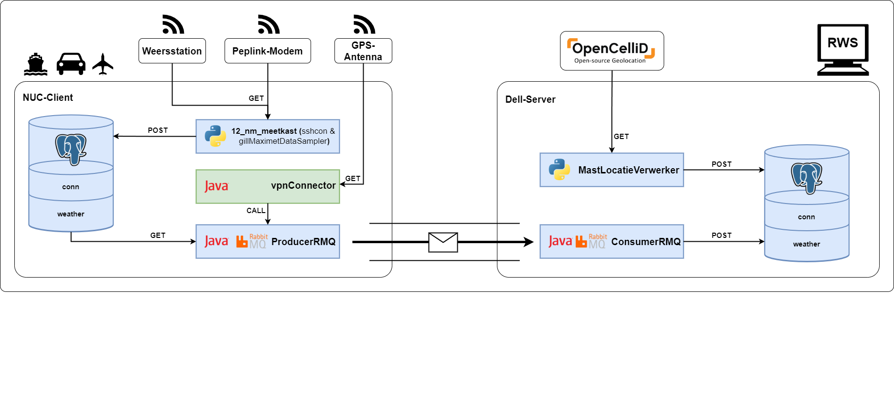

<a id="readme-top"></a>

[![Unlicense License][license-shield]][license-url]

<!-- PROJECT LOGO -->
<br />
<div align="center">
  <a href="https://github.com/RWS-CFNS/vpnConnector">
    
  </a>

  <h3 align="center">VPN-Connector</h3>

  <p align="center">
    Retrieves/Consumes data that has been send by a RabbitMQ Producer.
    <br />
    <a href="https://github.com/RWS-CFNS/vpnConnector"><strong>Explore the docs »</strong></a>
    <br />
    <br />
  </p>
</div>

<!-- TABLE OF CONTENTS -->
<details>
  <summary>Table of Contents</summary>
  <ol>
    <li>
      <a href="#about-the-project">About The Project</a>
      <ul>
        <li><a href="#built-with">Built With</a></li>
      </ul>
    </li>
    <li>
      <a href="#getting-started">Getting Started</a>
      <ul>
        <li><a href="#prerequisites">Prerequisites</a></li>
        <li><a href="#installation">Installation</a></li>
      </ul>
    </li>
    <li><a href="#usage">Usage</a></li>
    <li><a href="#license">License</a></li>
  </ol>
</details>

<!-- ABOUT THE PROJECT -->
## System Architecture Overview


This vpnConnector tool automates VPN management, location-based activation, and internet speed verification. It ensures a stable connection before securely transmitting data by dynamically loading configurations, checking GPS coordinates, and controlling VPN access.

Key Features
* Configuration Management: Loads settings from VPNconnector.properties for VPN, GPS, logging, and speed tests.
* VPN Handling: Starts/stops VPN using system commands, logs status, and verifies connectivity via ping.
* GPS-based Activation: Retrieves GPS data, verifies location, and activates VPN only in a predefined area.
* Internet Speed Testing: Uses iperf3 to measure speed, calculates averages, and checks connection stability.
* Data Transmission: Runs an external JAR (DATA_SENDER_JAR) to send data, confirming success via logs.
* Logging & Error Handling: Maintains timestamped logs and handles errors for VPN, GPS, and data transmission.

Use the `BLANK_README.md` to get started.

<p align="right">(<a href="#readme-top">back to top</a>)</p>

### Built With

This section lists any major frameworks/libraries used while developing this tool.

[![intellijidea][intellijidea.org]][intellijidea-url]
[![openjdk][openjdk.org]][openjdk-url]
[![RabbitMQ][Rabbitmq.com]][Rabbitmq-url]
[![JSON][json.org]][json-url]

<p align="right">(<a href="#readme-top">back to top</a>)</p>

## Getting Started

### Prerequisites

Java Runtime Environment (JRE):

Make sure you have a compatible JRE (Java Runtime Environment) installed, JRE 8 or higher is required.
   ```sh
   java -version
   ```
Network Permissions
* User must have permissions to modify network settings and execute system commands.

Software Dependencies
* VPN Client: OpenVPN, WireGuard, or another command-line accessible VPN client must be installed and configured.
* iperf3: Required for speed testing; ensure iperf3 is installed and accessible from the command line.
* GPS Server: A GPS data source (local or network-based) must be available and properly configured.
* Data Sender JAR: The RabbitMQ [ConsumerRMQ](https://github.com/RWS-CFNS/ConsumerRMQ/releases) application should be present and correctly referenced in the configuration.

Configuration Requirements
* VPNconnector.properties: Must include valid VPN command paths, GPS settings, logging directories, and network parameters.
* Correct VPN Credentials: If required, ensure authentication details are correctly set up for automatic connection.

### Installation

1. Download the latest release from the [Releases Page](https://github.com/RWS-CFNS/vpnConnector/releases) and extract the ZIP file.
2. Configure the parameters by updating the configuration file with your credentials and settings:
   ```python
    #The section below specifies what type of connection is being established. NOTE: Do not change these two values unless a different type of connection than Tailscale needs to be set up.
    VPN_CMD=tailscale 
    CONFIG_PATH=--ssh 
    
     #IP address and port of the network where the GPS data is received.
    GPS_IP=<IP_of_GPS_source>
    GPS_PORT=<port_GPS_source>
    
    #Geofencing 
    #The section below defines the coordinates where the measurement set must be located in order to establish a VPN connection and send data.
    MIN_LAT=<min_lat> 
    MAX_LAT=<max_lat> 
    MIN_LON=<min_long>  
    MAX_LON=<max_long>
    
    #Specifies how long the program should wait for GPS data before timing out due to no GPS data being received. The time is in seconds.
    GPS_TIMEOUT=10 
    
    #Specifies the directory where the program's log files will be stored. 
    LOG_DIRECTORY=logs 
    
    #The Tailscale IP of the speed test server.
    SPEED_TEST_SERVER=<ip_tailscale_speedtest_server> 
     
    #The number of speed tests to be performed.
    NUM_SPEED_TESTS=5
    
    #The time interval (in milliseconds) between each speed test.
    SPEED_TEST_INTERVAL=10000 
    
    #The maximum time allowed before data is received. If it takes longer than the specified time, the speed is considered 0 Mb/s. The time is in seconds.
    SPEED_TEST_TIMEOUT=5 
    
    #The required network speed (in Mb/s) before data can be transmitted.
    REQUIRED_SPEED = 20
    
    #The directory where producerRMQ.jar is located. NOTE: Ensure that producerRMQ.jar is in the specified location. DEFAULT: Same directory where vpn_Connector.jar is located.
    DATA_SENDER_JAR=producerRMQ.jar
    
    #The duration (in milliseconds) the program waits after each attempt to send data.
    PROGRAM_TIMEOUT = 600000
   ```
3. Run the script:
   ```sh
   java -jar vpnConnector.jar
   ```
When you run the program, it will establish a Tailscale VPN connection, check if the GPS coordinates are within the defined geofencing area, and perform multiple speed tests to ensure the network meets the required speed of 20 Mb/s. If the conditions are met, it will send data; otherwise, it will log any issues and retry the process.

## Usage
This program could be used for secure remote data transmission in a specific geographic area, where it ensures that the device is within a predefined location (using GPS) and that the network connection meets a certain speed threshold before sending sensitive data. It is ideal for applications like remote monitoring, IoT devices, or field operations where location and connectivity conditions are critical for successful data transmission.

<!-- LICENSE -->
## License

Distributed under the Unlicense License. See `LICENSE.txt` for more information.

<p align="right">(<a href="#readme-top">back to top</a>)</p>

<!-- MARKDOWN LINKS & IMAGES -->
<!-- https://www.markdownguide.org/basic-syntax/#reference-style-links -->
[license-shield]: https://img.shields.io/github/license/RWS-CFNS/vpnconnector.svg?style=for-the-badge
[license-url]: https://github.com/RWS-CFNS/vpnconnector/blob/main/LICENSE

[intellijidea.org]: https://img.shields.io/badge/intellijidea-D952FF?style=for-the-badge&logo=intellijidea&logoColor=white
[intellijidea-url]: https://jetbrains.com/
[Python.org]: https://img.shields.io/badge/Python-1985A1?style=for-the-badge&logo=python&logoColor=white
[Python-url]: https://python.org/
[Opencellid.org]: https://img.shields.io/badge/Opencellid-F09728?style=for-the-badge
[Opencellid-url]: https://Opencellid.org/
[openjdk.org]: https://img.shields.io/badge/openjdk-0075C9?style=for-the-badge&logo=openjdk&logoColor=white
[openjdk-url]: https://openjdk.org/
[Rabbitmq.com]: https://img.shields.io/badge/rabbitmq-FF6600?style=for-the-badge&logo=rabbitmq&logoColor=white
[Rabbitmq-url]: https://rabbitmq.com/
[json.org]: https://img.shields.io/badge/json-589632?style=for-the-badge&logo=json&logoColor=white
[json-url]: https://json.com/
